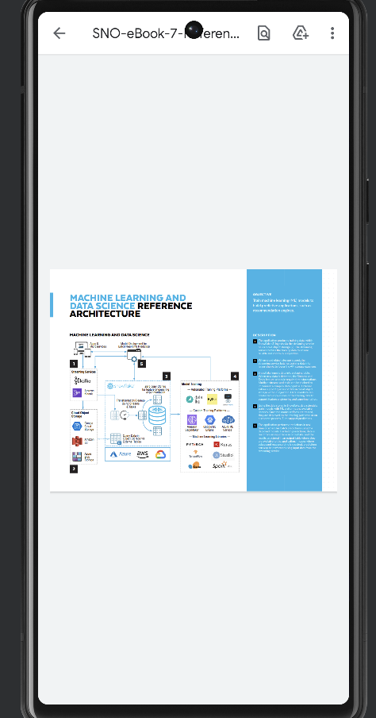

# cmpe277_servicesapp

### Learning Objective:

The purpose of the App is to use Android Services (background) to download following files:

PDF Download Activity: Download PDF files from the internet

### Home Page:

### Before download:

### During Download : Downloads can be observed in logs:

### After download:

